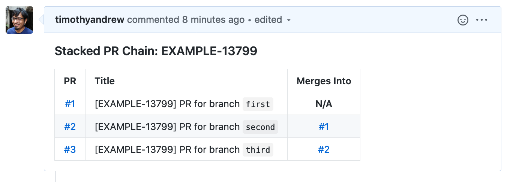

# gh-stack [](https://travis-ci.org/timothyandrew/gh-stack)

I use this tool to help managed stacked pull requests on Github, which are notoriously difficult to manage manually. Here are a few examples:

- https://unhashable.com/stacked-pull-requests-keeping-github-diffs-small
- https://stackoverflow.com/questions/26619478/are-dependent-pull-requests-in-github-possible
- https://gist.github.com/Jlevyd15/66743bab4982838932dda4f13f2bd02a

This tool assumes that:

- All PRs in a single "stack" all have a unique identifier in their title (I typically use a Jira ticket number for this).
- All PRs in the stack live in a single GitHub repository.
- All remote branches that these PRs represent have local branches named identically.

It then looks for all PRs containing this containing this identifier and builds a dependency graph in memory. This can technically support a "branched stack" instead of a single chain, but I haven't really tried the latter style. With this graph built up, the tool can:

- Add a markdown table to the PR description (idempotently) of each PR in the stack describing _all_ PRs in the stack.
- Log a simple list of all PRs in the stack (+ dependencies) to stdout.
- Automatically update the stack + push after making local changes.

---

- [Installation](#installation)
- [Usage](#usage)
  - [Examples](#examples)
- [Strategy](#strategy)
- [Disclaimer](#disclaimer)


## Installation

Building from source is the only option at the moment:

```bash
# Install Rust
$ curl --proto '=https' --tlsv1.2 -sSf https://sh.rustup.rs | sh

# Configure `PATH`
$ export PATH="$HOME/.cargo/bin:$PATH"

# Install `gh-stack`
$ cargo install gh-stack
```

## Usage

```bash
$ export GHSTACK_OAUTH_TOKEN='<personal access token>'

$ gh-stack

USAGE:
    gh-stack <SUBCOMMAND>

FLAGS:
    -h, --help    Prints help information

SUBCOMMANDS:
    annotate      Annotate the descriptions of all PRs in a stack with metadata about all PRs in the stack
    autorebase    Rebuild a stack based on changes to local branches and mirror these changes up to the remote
    log           Print a list of all pull requests in a stack to STDOUT
    rebase        Print a bash script to STDOUT that can rebase/update the stack (with a little help)

# Idempotently add a markdown table summarizing the stack
# to the description of each PR in the stack.
$ gh-stack annotate 'stack-identifier'

# Same as above, but precede the markdown table with the 
# contents of `filename.txt`.
$ gh-stack annotate 'stack-identifier' -p filename.txt

# Print a description of the stack to stdout.
$ gh-stack log 'stack-identifier'

# Automatically update the entire stack, both locally and remotely.
# WARNING: This operation modifies local branches and force-pushes.
$ gh-stack autorebase 'stack-identifier' -C /path/to/repo

# Emit a bash script that can update a stack in the case of conflicts.
# WARNING: This script could potentially cause destructive behavior.
$ gh-stack rebase 'stack-identifier'
```

### Examples

*This is a quick overview of the ways this tool could be used in practice.*

1. Write some code, create local commits/branches:
    ```bash
    $ git checkout -b first
    # Write code
    $ git add -A; git commit -m 'first'
  
    $ git checkout -b second
    # Write code
    $ git add -A; git commit -m 'second #1'
    # Write code
    $ git add -A; git commit -m 'second #2'
  
    $ git checkout -b third
    # Write code
    $ git add -A; git commit -m 'third'
    ```

2. Your Git tree now looks like:  
    ```bash
    * 42315c4 U - (third) third
    |
    * 6db2c28 U - (second) second #2
    |
    * 5746a83 U - second #1
    |
    * e845ded U - (first) first
    |
    * 8031011 U - initial commit
    ```

3. Push each branch:
    ```bash
    $ git push origin first:first second:second third:third
      * [new branch]      first -> first
      * [new branch]      second -> second
      * [new branch]      third -> third
    ```

4. Create a PR for each new branch (starting at `first`), and:
    - Ensure that all the PRs have a common identifier in their title (I'll use `[EXAMPLE-17399]` here). This identifier (currently) is required to be unique across all GitHub repositories accessible to you (including _all_ public repositories).
    - Set the `base` for each PR to the branch preceding it. Here, `first`'s PR is set to merge into `master`, `second`'s PR is set to merge into `first`, and `third`'s PR is set to merge into `second`.

5. Log all PRs in the stack:
    ```bash
    $ gh-stack log 'EXAMPLE-13799'
     #1: [EXAMPLE-13799] PR for branch `first` (Base)
     #2: [EXAMPLE-13799] PR for branch `second` (Merges into #1)
     #3: [EXAMPLE-13799] PR for branch `third` (Merges into #2)
    ```

6. Annotate all PRs with information about the stack:
    ```bash
    $ gh-stack annotate 'EXAMPLE-13799'
     1: [EXAMPLE-13799] PR for branch `first`
     2: [EXAMPLE-13799] PR for branch `second`
     3: [EXAMPLE-13799] PR for branch `third`
     Going to update these PRs ☝️  Type 'yes' to continue: yes
     Done!
    ```

   This (idempotently) adds a table like this to the description of every PR in the stack:
       

7. Make changes to a branch that rewrites commits in some way (amend, remove a commit, combine commits):
    ```bash
    $ git checkout first
    # Do some work
    $ git add -A; git commit --amend -m 'amended first'
    ```

   History has now diverged, and this will cause conflicts with dependent PRs when `first` is (force-)pushed.
     ```bash
     * e7cb9c6 U - (HEAD -> first) amended first
     |
     | * 42315c4 N - (origin/third, third) third
     | |
     | * 6db2c28 N - (origin/second, second) second #2
     | |
     | * 5746a83 N - second #1
     | |
     | * e845ded N - (origin/first) first
     |/
     |
     * 8031011 U - (origin/master, master) initial commit
     ```

8. Use the `autorebase` subcommand to fix this inconsistency (it requires a path to a local checkout of the repository):
    ```bash
    $ gh-stack autorebase --repo /tmp/test EXAMPLE-13799
    Checking out Commit { id: 803101159653bf4bf92bf098e577abc436458b17, summary: "initial commit" }
 
    Working on PR: "first"
    Cherry-picking: Commit { id: e7cb9c6cdb03374a6c533cbf1fc23a7d611a73c7, summary: "amended first" }
 
    Working on PR: "second"
    Cherry-picking: Commit { id: 5746a83aed004d0867d52d40efc9bd800b5b7499, summary: "second #1" }
    Cherry-picking: Commit { id: 6db2c2817dfed244d5fbd8cbb9b8095965ac9a05, summary: "second #2" }
 
    Working on PR: "third"
    Cherry-picking: Commit { id: 42315c46b42044ebc4b57a995a75b97699f4855a, summary: "third" }
 
    ["b45e5838a93b33411a5f0c9f726bc1987bc71ff5:refs/heads/first", "93170d2199ed9c2ae30d1e7492947acf477fb035:refs/heads/second", "a85a1931c44c3138d993128591af2cad2ef6c68d:refs/heads/third"]
    Going to push these refspecs ☝️  Type 'yes' to continue: yes
    Enumerating objects: 12, done.
    Counting objects: 100% (12/12), done.
    Delta compression using up to 8 threads
    Compressing objects: 100% (8/8), done.
    Writing objects: 100% (11/11), 907 bytes | 453.00 KiB/s, done.
    Total 11 (delta 3), reused 0 (delta 0)
    remote: Resolving deltas: 100% (3/3), done.
    To github.com:timothyandrew/test.git
     + e845ded...b45e583 b45e5838a93b33411a5f0c9f726bc1987bc71ff5 -> first (forced update)
     + 6db2c28...93170d2 93170d2199ed9c2ae30d1e7492947acf477fb035 -> second (forced update)
     + 42315c4...a85a193 a85a1931c44c3138d993128591af2cad2ef6c68d -> third (forced update)
 
    Updating local branches so they point to the new stack.
 
      + Branch first now points to b45e5838a93b33411a5f0c9f726bc1987bc71ff5
      + Branch second now points to 93170d2199ed9c2ae30d1e7492947acf477fb035
      + Branch third now points to a85a1931c44c3138d993128591af2cad2ef6c68d
    All done!
    ```

    - This restores local history to a flat list and pushes the tip of each branch up to update the PRs themselves.
      ```bash
      * a85a193 N - (HEAD, origin/third, third) third
      |
      * 93170d2 N - (origin/second, second) second #2
      |
      * 61f64b6 N - second #1
      |
      * b45e583 N - (origin/first, first) amended first
      |
      * 8031011 U - (origin/master, master) initial commit
      ```
  
    - If conflicts are encountered, `autorebase` will pause and allow you to fix the conflicts before resuming.

## Strategy

This is a quick summary of the strategy the `autorebase` subcommand uses:

1. Find the `merge_base` between the local branch of the first PR in the stack and the branch it merges into (usually `develop`). This forms the boundary for the initial cherry-pick. This is a heuristic and is not suitable for all situations, especially when changes have already been pushed or PRs are merged directly on GitHub. Accept an explicit boundary for the initial cherry-pick to avoid ambiguity here.
2. Check out the commit/ref that the first PR in the stack merges into (usually `develop`). We're going to cherry-pick the entire stack onto this commit.
3. Cherry-pick all commits from the first PR (stopping at the cherry-pick boundary calculated in 1.) onto `HEAD`.
4. Move the _local_ branch for the first PR so it points at `HEAD`.
5. The _remote tracking_ branch for the first PR becomes the next cherry-pick boundary.
6. Repeat steps 3-5 for each subsequent PR until all PRs have been cherry-picked over.
7. Push all refs at once by passing multiple refspecs to a single invocation of `git push -f`.

## Disclaimer

Use at your own risk (and make sure your git repository is backed up), especially because:

- This tool works for my specific use case, but has _not_ been extensively tested.
- I've been writing Rust for all of 3 weeks at this point.
- The `autorebase` command is in an experimental state; there are possibly edge cases I haven't considered.
