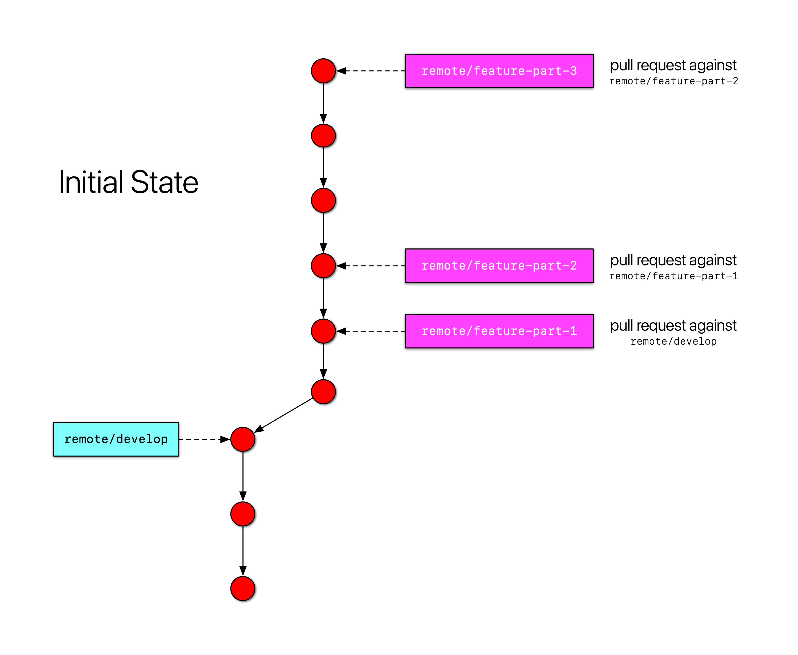
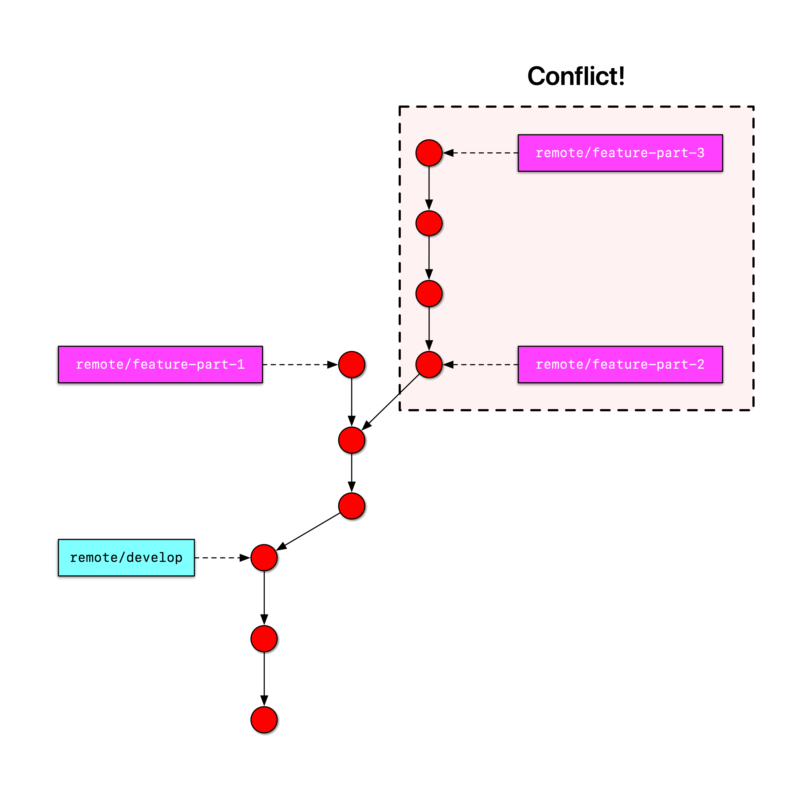
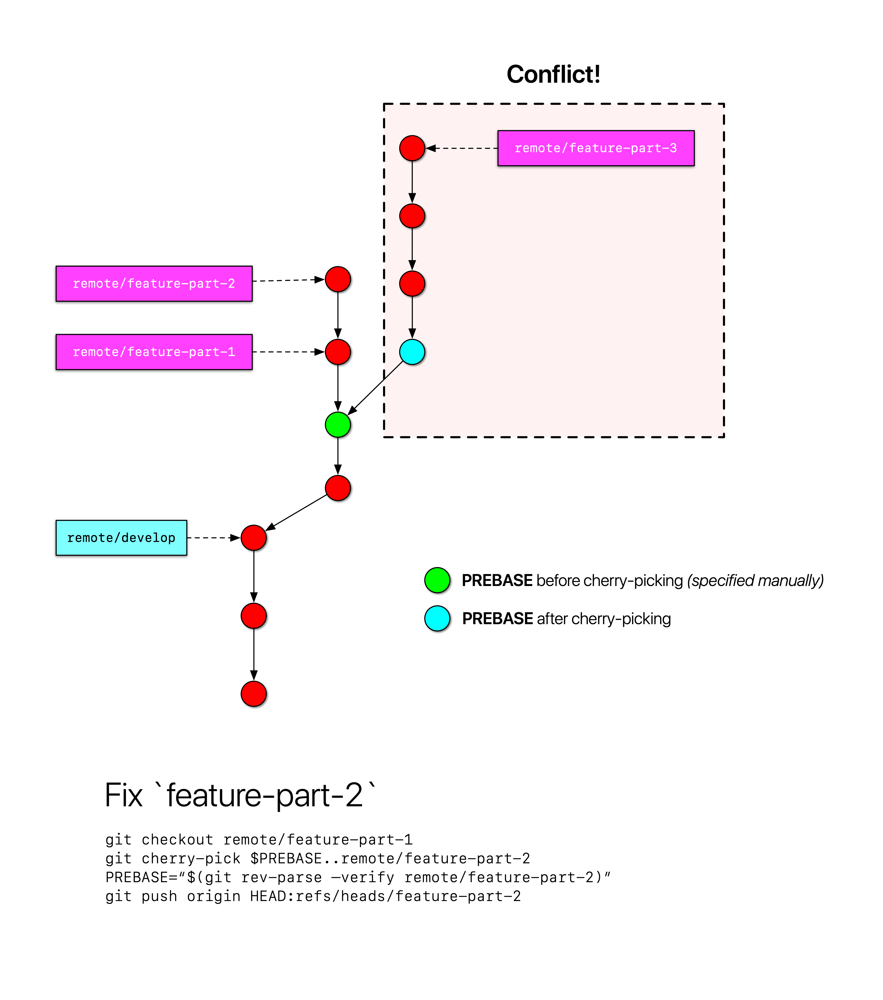
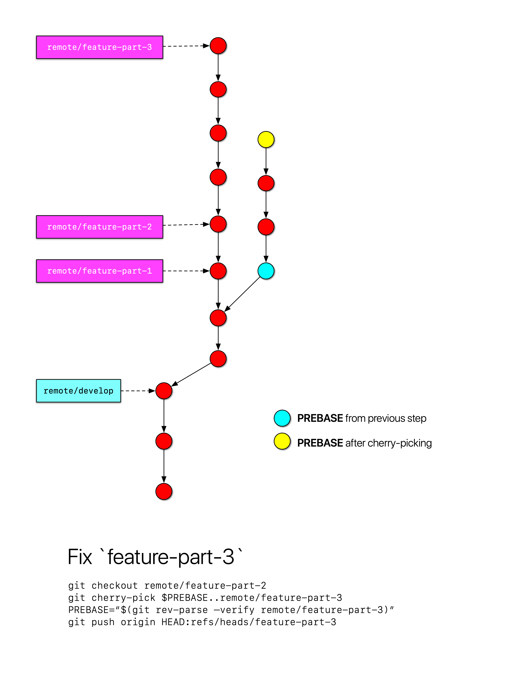
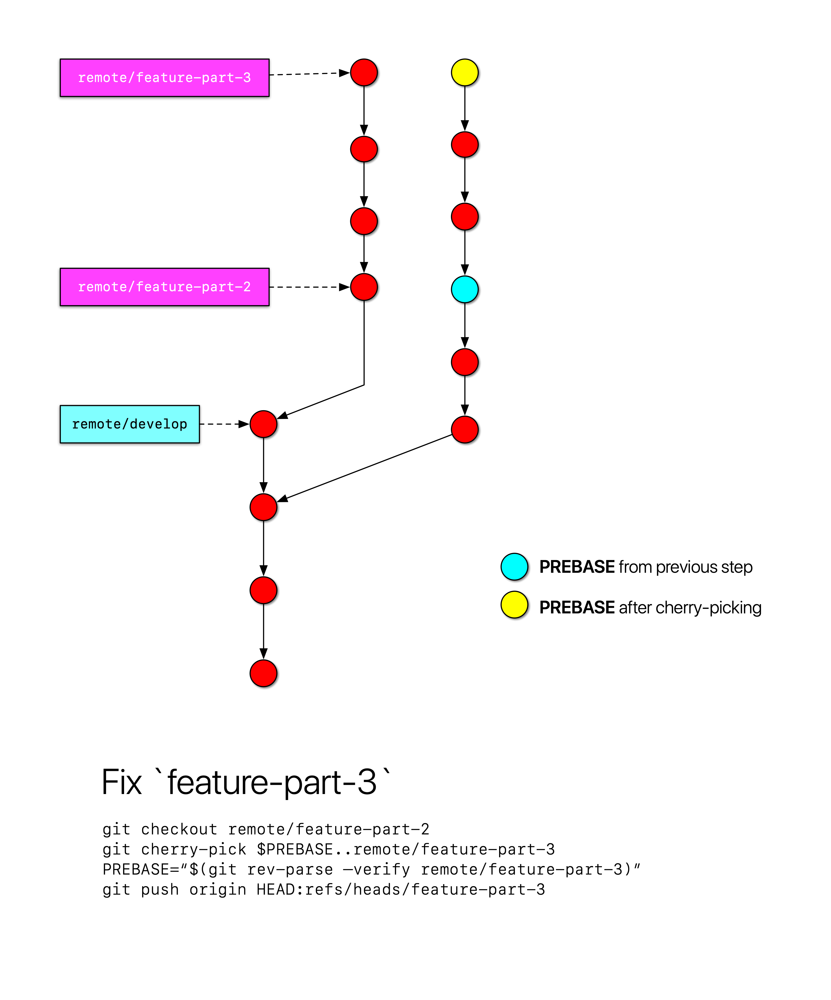

# gh-stack 

- [Usage](#usage)
- [Strategy](#strategy)
  - [Feature Changes](#feature-changes)
  - [Feature Complete & Merged](#feature-complete--merged)
- [Disclaimer](#disclaimer)

---

I use this tool to help managed stacked pull requests on Github, which are notoriously difficult to manage manually. Here are a few examples:

- https://unhashable.com/stacked-pull-requests-keeping-github-diffs-small
- https://stackoverflow.com/questions/26619478/are-dependent-pull-requests-in-github-possible
- https://gist.github.com/Jlevyd15/66743bab4982838932dda4f13f2bd02a

This tool assumes that all PRs in a single "stack" all have a unique identifier in their title (I typically use a Jira ticket number for this). It then looks for all PRs containing this containing this identifier and builds a dependency graph in memory. This can technically support a "branched stack" instead of a single chain, but I haven't really tried the latter style. Note that the `gh-stack rebase` command will definitely _not_ work with the branched style.

With this graph built up, the tool can:

- Add a markdown table to the PR description (idempotently) of each PR in the stack describing _all_ PRs in the stack.
- Log a simple list of all PRs in the stack (+ dependencies) to stdout.
- Emit a bash script that can update all PRs in the stack.
  - This generally happens in the event of:
    - The PR at the base of the stack is merged, leaving all the remaining PRs in a conflicted state.
    - One of the PRs (not the top of the stack) has a commit added to it, leaving all dependent PRs in a conflicted state.
  - The script requires two placeholders to be manually specified before execution.

## Usage

```bash
$ export GHSTACK_OAUTH_TOKEN='<personal access token>'

# Idempotently add a markdown table summarizing the stack
# to the description of each PR in the stack.
$ gh-stack github 'stack-identifier'

# Same as above, but precede the markdown table with the 
# contents of `filename.txt`.
$ gh-stack github 'stack-identifier' filename.txt

# Print a description of the stack to stdout.
$ gh-stack log 'stack-identifier'

# Emit a bash script that can update a stack in the case of conflicts.
# WARNING: This script could potentially cause destructive behavior.
$ gh-stack rebase 'stack-identifier'
```
  
## Strategy

Here's a quick summary of the strategy that the bash script described above uses to keep the stack up-to-date.

Let's use this stack as an example:



### Feature Changes

In the first case, let's assume that "feature part 1" had some changes added to it in the form of a commit; this leaves parts 2 & 3 in a conflicted state:



The script requires that you pass in a `PREBASE` ref (which is essentially the boundary for the feature part you're operating on - in this case the _parent of the_ last/oldest commit in feature-part-2).
The script starts cherry-picking commits at this ref for the first iteration. An initial `TO` ref is also required, which is the point upon which you want to rebase the rest of the stack. In this case, that ref is `remote/feature-part-1`).

The script executes a single step, we now have this intermediate state:



The script completes execution, and we now have this final state with the entire stack updated/recreated:



### Feature Complete & Merged

In the second case, let's assume that "feature part 1" is done and has been merged to `develop`:


This immediately leaves feature parts 2 & 3 in a conflicted state. The script can fix this situation as well.
As before, pass a `PREBASE` (in this case _the parent of the_ oldest commit in feature part 2) and an initial `TO` ref to rebase on (in this case `remote/develop`).

Once the script executes a single step, we're left with:


And once the script is done:



## Disclaimer

Use at your own risk (and make sure your git repository is backed up), especially because:

- This tool works for my specific use case, but has _not_ been extensively tested.
- I've been writing Rust for all of 3 weeks at this point.
- The script that `gh-stack rebase` emits attempts to force-push when executed.
